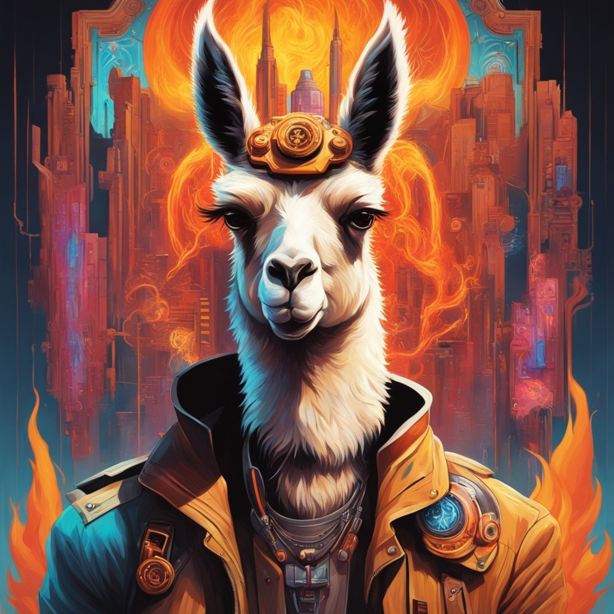

# Llama Burn

<div align="center">
    
</div>

The popular Llama LLM is here!

This repository contains the
[Llama 3.2, Llama 3.1, Llama 3](https://github.com/meta-llama/llama-models/), and
[TinyLlama](https://github.com/jzhang38/TinyLlama) implementations with their corresponding
tokenizers. You can find the [Burn](https://github.com/tracel-ai/burn) implementation for the Llama
variants in [src/llama.rs](src/llama.rs).

## Usage

### `Cargo.toml`

Add this to your `Cargo.toml`:

```toml
[dependencies]
llama-burn = { git = "https://github.com/tracel-ai/models", package = "llama-burn", default-features = false }
```

If you want to use Llama 3 or TinyLlama (including pre-trained weights if default features are
active), enable the corresponding feature flag.

> **Important:** these features require `std`.

#### Llama 3

```toml
[dependencies]
llama-burn = { git = "https://github.com/tracel-ai/models", package = "llama-burn", features = ["llama3"] }
```

#### TinyLlama

```toml
[dependencies]
llama-burn = { git = "https://github.com/tracel-ai/models", package = "llama-burn", features = ["tiny"] }
```

### Example Usage

The [chat completion example](examples/chat.rs) initializes a Llama model from the provided weights
file and generates a sequence of text based on the input prompt. The instruction-tuned model is
loaded for dialogue applications, so the prompt is automatically formatted for chat completion.

The example can be executed on the `tch` backend (CUDA or CPU), `cuda` or `vulkan` (wgpu).

| Argument        | Description                                                                                                    |
| :-------------- | :------------------------------------------------------------------------------------------------------------- |
| `-p`            | The prompt or question to pass to the LLM (default: `"How many helicopters can a human eat in one sitting?"`). |
| `-n`            | The number of new tokens to generate (default: `50`).                                                          |
| `--top-p`       | Top-p probability threshold (default: `0.9`).                                                                  |
| `--temperature` | Temperature value for controlling randomness in sampling. (default: `0.6`).                                    |
| `--max-seq-len` | Maximum sequence length for input text. (default: `128`).                                                      |
| `--seed`        | The seed to use when generating random samples.. (default: `42`).                                              |

Any of the commands below can be used by appending any of the listed arguments by appending
`[-- <arguments>]`. For example, you can provided your own prompt/question
`-- -p "How many llamas does it take to change a lightbulb?"`.

#### Llama 3

Using the `tch` backend with CUDA:

```sh
export TORCH_CUDA_VERSION=cu128
cargo run --release --features llama3,tch-gpu --example chat
```

Using the `tch` backend with CPU:

```sh
cargo run --release --features llama3,tch-cpu --example chat
```

Using the `vulkan` backend:

```sh
cargo run --release --features llama3,vulkan --example chat
```

Using the `cuda` backend:

```sh
cargo run --release --features llama3,cuda --example chat
```

**Built with Meta Llama 3.** This example uses the
[Meta-Llama-3.2-1B-Instruct](https://huggingface.co/meta-llama/Llama-3.2-1B-Instruct) (default),
[Meta-Llama-3.2-3B-Instruct](https://huggingface.co/meta-llama/Llama-3.2-3B-Instruct),
[Meta-Llama-3.1-8B-Instruct](https://huggingface.co/meta-llama/Meta-Llama-3.1-8B-Instruct) and
[Meta-Llama-3-8B-Instruct](https://huggingface.co/meta-llama/Meta-Llama-3-8B-Instruct)
instruction-tuned models. Note that the [base pre-trained Llama-3 model](./src/pretrained.rs#L77) is
also available if you wish to use it in your application.

#### TinyLlama

Using the `tch` backend with CUDA:

```sh
export TORCH_CUDA_VERSION=cu128
cargo run --release --features tiny,tch-gpu --example chat
```

Using the `tch` backend with CPU:

```sh
cargo run --release --features tiny,tch-cpu --example chat
```

Using the `vulkan` backend:

```sh
cargo run --release --features tiny,vulkan --example chat
```

Using the `cuda` backend:

```sh
cargo run --release --features tiny,cuda --example chat
```

This example uses the
[TinyLlama-1.1B-Chat-v1.0](https://huggingface.co/TinyLlama/TinyLlama-1.1B-Chat-v1.0)
instruction-tuned model based on the Llama2 architecture and tokenizer.

